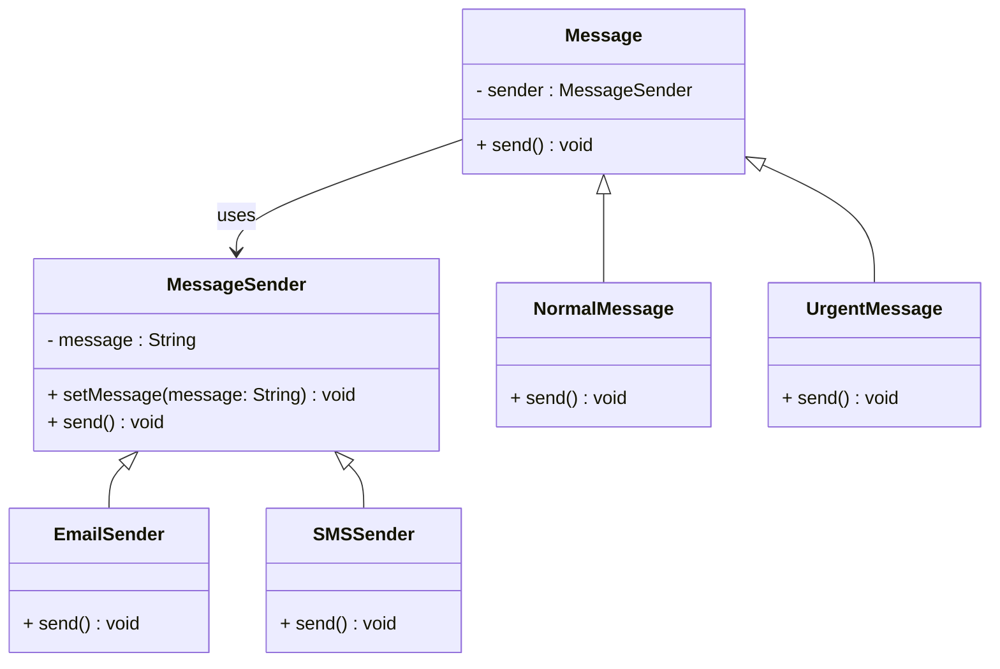

# Bridge Design Pattern

A structural design pattern that separates abstraction from implementation. This allows objects to vary without binding it to the abstraction.

> **abstraction** (also called *interface*) is an idea that a concrete class must implement. 

> **implementation** layer is the actual code that fulfills the contract defined by an abstraction (interface or abstract class).

## Real-World Analogy

Imagine your **Remote Control** (*abstraction*). The remote can be of different types: Basic, Advanced Remote.
On the other side, you have **Devices** (*implementor*) like TV, Radio, or Projector.

The idea is that the remote control doesn't need to know how the Devices works internally. It would just call the functions (*contracts defined*) like `turnOn`, `setChannel`, `volumeUp`, etc.

## In This Example

Let's take an example.

A `Message` is an abstraction that defines the contract for us to `send` any kind of message.
`MessageSender` is an implementation.

