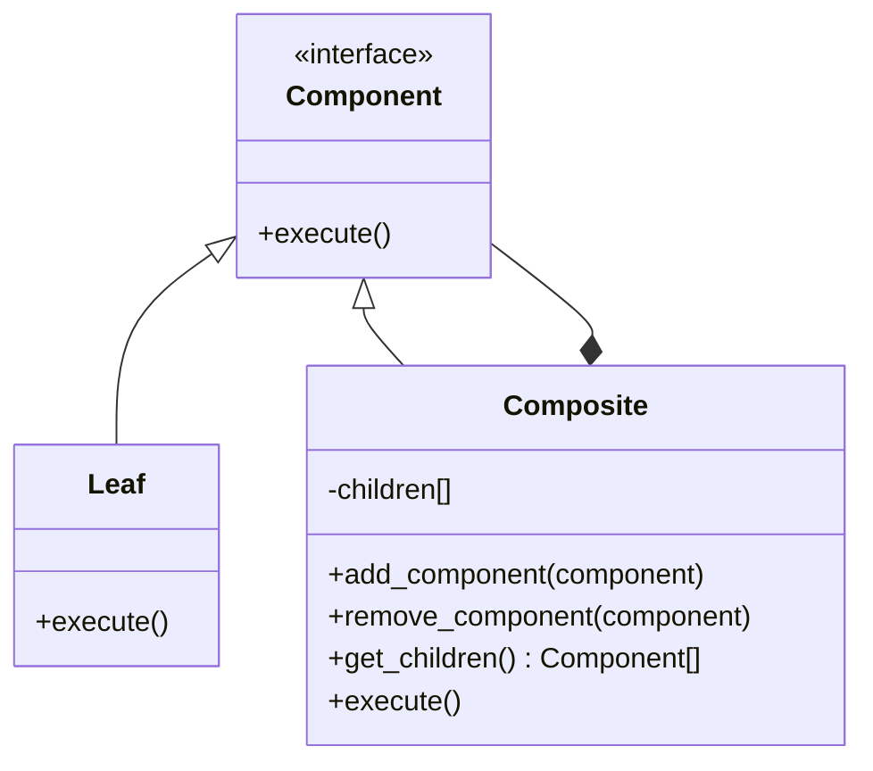

# Composite

A structural design pattern that allows us to compose objects into tree structures to represent part-whole hierarchies then work on individual objects uniformly.

## Real-World Analogy

In a company, we have:
- Employees (leaf objects)
- Managers (composite objects) - *which they can have employees or even other managers reporting to them*

## Basic Structure

