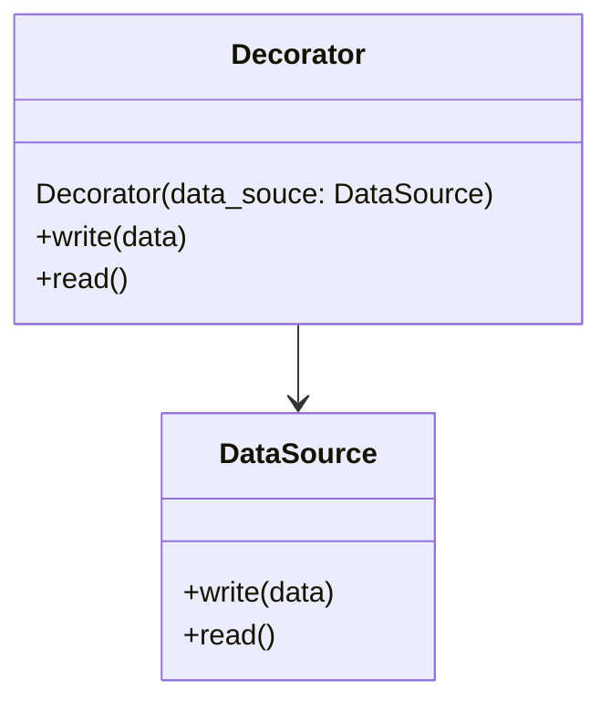

# Decorator

A structural design pattern that allows behaviour to be added to individual objects, either statically or dynamically, without affecting the behaviour of other objects.

## In this example

A phone notification usually have subject and content (**ToastNotification**). Meanwhile, our phone would allow us to show notifications privately (hidden content) / sensored  **ToastPrivacyNotification** *decorator*.
