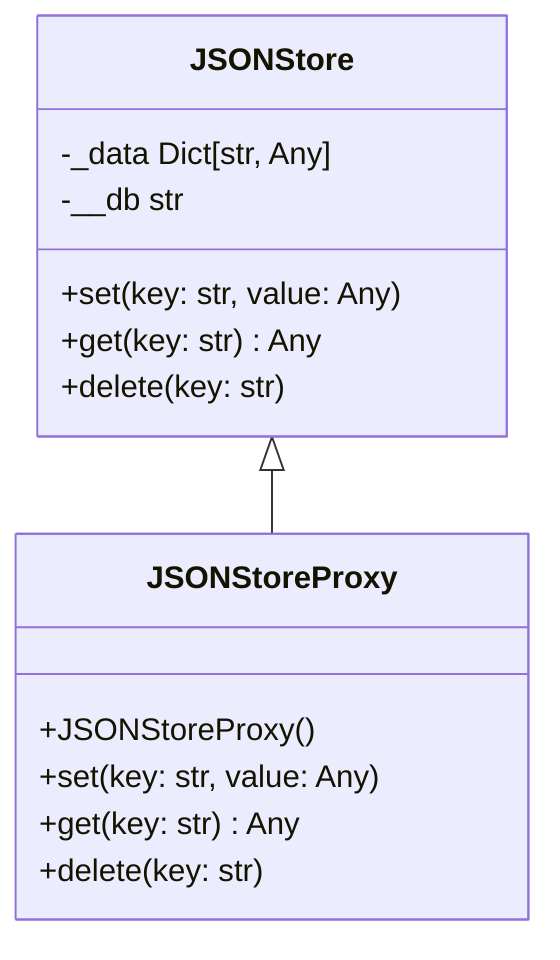

# Proxy

A structural design pattern that allows us to substitute an object with another object.

## Use cases

Access control → Check permissions before calling pay()

Lazy initialization → Create the real object only when needed

Remote proxy → Handle communication with a remote service

Caching proxy → Cache results from expensive operations

## An example

